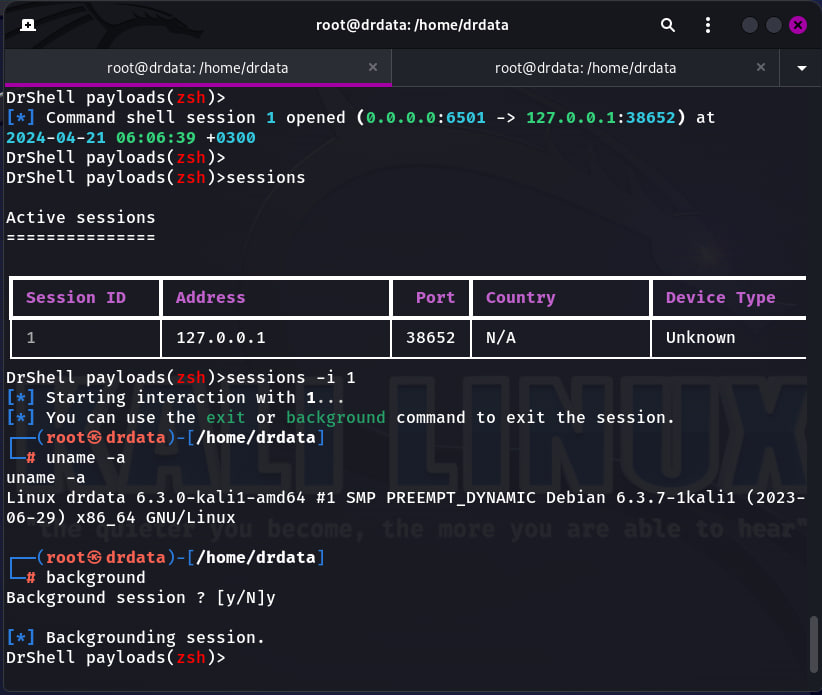

# DrShell: A Reverse Shell Session Manager 🌐

Welcome to the exhilarating world of DrShell! 🎉 DrShell is a cutting-edge tool designed for the dynamic management of reverse shell sessions. Whether you are a seasoned security professional, a network administrator, or a cybersecurity enthusiast, DrShell equips you with the necessary arsenal to monitor and control your reverse shell environments effectively and stylishly.

## Features 🌟

DrShell allows you to handle multiple reverse shell sessions seamlessly. Here's a breakdown of its core functionalities:

- **Multiple Shell Management**: Toggle between various active reverse shell sessions with ease.
- **SignalShell Multi-Handler**: Custom signal handling for advanced session controls.
- **Netcat TCP Multi-Handler**: Robust TCP handling capabilities for traditional reverse shell operations.
- **HTTP File Smuggler**: Simplified and powerful HTTP-based file smuggling.

## Installation 🛠️

DrShell is readily installable on both Linux and Termux environments using just a couple of commands:

### For Linux:

```bash
wget https://github.com/DrDataYE/DrShell/releases/download/drshell/drshell_1.0.1_all_linux_beta.deb -O drshell_1.0.1_all_linux_beta.deb && sudo dpkg -i drshell_1.0.1_all_linux_beta.deb
```

### For Termux:

```bash
pkg install wget -y &&pkg install python3 -y &&wget https://github.com/DrDataYE/DrShell/releases/download/drshell/drshell_1.0.1_all_termux_beta.deb -O drshell_1.0.1_all_termux_beta.deb && dpkg -i drshell_1.0.1_all_termux_beta.deb
```

## Usage 🚀

Fire up DrShell and take control of your reverse shell sessions in no time! Here's how you can get started:

```bash
drshell -h
```

This command will show you all the options available:

```
usage: drshell [-h] [-p PORT] [-x SIGNAL_PORT] [-n NETCAT_PORT] [-f FILE_SMUGGLER_PORT]

DrShell Command Line

options:
  -h, --help            show this help message and exit
  -p PORT, --port PORT  Port for the Team Server
  -x SIGNAL_PORT, --signal_port SIGNAL_PORT
                         Port for the signalShell Multi-Handler
  -n NETCAT_PORT, --netcat_port NETCAT_PORT
                         Port for the Netcat TCP Multi-Handler
  -f FILE_SMUGGLER_PORT, --file_smuggler_port FILE_SMUGGLER_PORT
                         Port for the HTTP File Smuggler
```

## Exciting Screenshots 📸

Here are some snapshots to guide you through the various phases of using DrShell:

- **Launching DrShell**:
  

- **Choosing a Payload**:
  

- **Setting Payload Options and Launching**:
  

- **New Session Notification**:
  

- **Interacting with a Session**:
  

## Legal Disclaimer ⚖️

DrShell is intended for educational and lawful purposes only, such as penetration testing authorized systems and training exercises. 📚🔒

**Using DrShell for unauthorized access to devices or networks is illegal and unethical.** 🚫 Misuse of DrShell can result in criminal charges brought against the persons in question. Compliance with all applicable laws is the responsibility of the user. Remember, with great power comes great responsibility!

## Dive In! 🌊

Prepare to transform your network security and session management capabilities with DrShell. Download it today, and unlock the full potential of your cybersecurity toolkit!

🎯 **Happy Hacking!** 🎯
